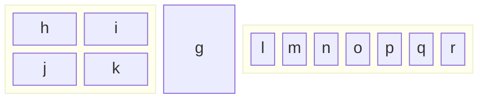

### Background
When two applications running on separate machines want to communicate with one another they have to send data over the network. In the common scenario, the application has access to the operating system which provides a so called Socket API which usually invokes a system call that passes the data to the kernel. Those are the well-know socket(), bind(), listen(), send(), recv() [sources]. The data then gets pushed thorough various processing layers e.g. L4 TCP/UDP or L3 IP. The former could take care of adding adequate TCP/UDP headers, updating connection states, buffering the data until enough is gathered for transmission[Nagle algorithm] and the latter that could be responsible for choosing an appropriate interface (routing), filtering or fragmentation. This path will be dependant on the networking stack used and there are a lot of those appearing right now (reference). The rise of complexities and variaty of networking stacks has to do with growing bandwidths of IO devices, which are overtaking the growth in processing capabilities of the CPUs. Other factors that warrant changes to the network stack is the need of better traffic latency, policing and observability. For the latter two a lot of new eBPF approaches (Cilium, Hubble) are seeing great development. No matter the processing stack, inevitably, the data has to end up in the network driver which is a piece of software that communicates with the physical device.

The objective of this guide is to look at that last piece which should give the idea of how the software ACTUALLY talks with networking device, and thus, the network itself. I find that barrier necessary to understand as it provides a worthwile mental model of the responsibility split. Everything prior to that (or above, speaking from the stack perspective) and up to this point is software - regular CPU and memory hierarchies thinking applies. Further down, the device takes over and can be thought as a logical entity. It can be analyzed as a blackbox which only does what the reference manual tells us it's role is [HRM]. A developer doesn't know it's internals, nor should he/she.  

#### mlx5
For those with access, a succint description can be found in [Chapter 2.](Autonomous NIC offloads).
Mellanox, acquired by Nvidia in 2020, is an important player in the market of high performance networking cards. Their cards are controlled by a mlx5 driver and verbs API that this guide is going to look at. 

#### XLIO

###

#### Network Interface Card

mindmap
  root((Digital Communications Subsystems))
    Network interface
     NIC
      receive data from analog source
      compute simple things over data and place it into specific memory location defined by system driver
     DPU
      add more extensive compute capabilities to the network card
    System API
     Sockets API
     io_uring
     XDP sockets
    Network
     Devices
      hardware implementation of protocols
     Protocols
      Routing
       Act of choosing an output interface based on routing information
      Tunneling
       Adding or removing headers, while changing some fields
     Links
      Different kinds of connectors, logically they have a bandwidth and delay
     Flows 
      Identified by signature of traffic e.g. **n**tuple or some payload feature

## LibXLIO

NVIDIA's (Mellanox's before) LIBXLIO is a library which dynamically replaces the socket API with a custom TCP stack. It's based on [lwip](https://savannah.nongnu.org/projects/lwip/)

